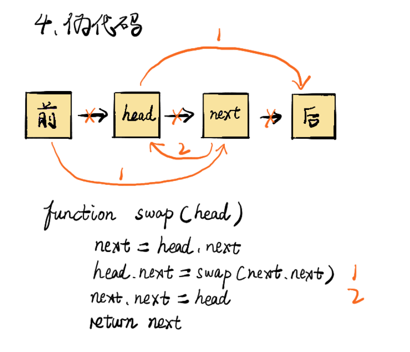

# 06 | 面试题：反转一个单链表&判断链表是否有环

https://leetcode-cn.com/problems/reverse-nodes-in-group


1. #### [206. 反转链表](https://leetcode-cn.com/problems/reverse-linked-list/)

   ```wiki
   反转一个单链表。
   
   示例:
   输入: 1->2->3->4->5->NULL
   输出: 5->4->3->2->1->NULL
   进阶:
   你可以迭代或递归地反转链表。你能否用两种方法解决这道题？
   
   链接：https://leetcode-cn.com/problems/reverse-linked-list
   ```

   ****

   **解法一: 迭代方法**  <br/>

   ```c++
   class Solution {
   public:
       ListNode* reverseList(ListNode* head) {
           if(head==NULL)
               return NULL;
           //ListNode* curr, pre = head, NULL;
           ListNode* curr = head;
           ListNode* pre = NULL;
           while(curr){
               ListNode* tmp = curr->next;
               curr->next = pre;
               pre = curr;
               curr = tmp;
           }
           return pre;
       }
   };
   ```

   解题思路：遍历链表，每一次保存前一个节点与后一个节点，交换当前节点与前一个节点 <br/>

   

   **解法二: 递归方法**  <br/>

   ```c++
   //尾递归
   public ListNode reverseList(ListNode head) {
       return reverse(null,head);
   }
   
   private static ListNode reverse(ListNode pre,ListNode cur){
       if(cur==null) return pre;
       ListNode next = cur.next;
       cur.next = pre;
       return reverse(cur,next);
   }
   ```

   

2. #### [24. 两两交换链表中的节点](https://leetcode-cn.com/problems/swap-nodes-in-pairs/)

   ```wiki
   给定一个链表，两两交换其中相邻的节点，并返回交换后的链表。
   你不能只是单纯的改变节点内部的值，而是需要实际的进行节点交换。
   
   示例:
   给定 1->2->3->4, 你应该返回 2->1->4->3.
   ```

   ****

   **解法一：** <br/>

   ```c++
   class Solution {
   public:
       //使用pre保存前一个节点
       ListNode* swapPairs(ListNode* head) {
           if(head==NULL || head->next==NULL)  //为空或只有一个元素时，一个元素因为有head = head->next;不直接返回会报错
               return head;
           ListNode* pre = head;
           ListNode* curr = head; //放到head = head->next;前面
           head = head->next;
           while(curr && curr->next){
               ListNode* pnext = curr->next;
               ListNode* tmp = pnext->next;
               pre->next = pnext;
               pnext->next = curr;
               curr->next = tmp;
               if(tmp && tmp->next){
                   pre = curr;
                   curr = tmp;
               }else{
                   break;
               }    
           }
           return head;
       }
   };
   ```

   总结：只要是链表交换节点，一定会涉及到3个节点。pre/curr/next。<br/>

   **递归解法: ** <br/>

   ```c++
   class Solution {
       public ListNode swapPairs(ListNode head) {
           if(head == null || head.next == null){
               return head;
           }
           ListNode next = head.next;
           head.next = swapPairs(next.next);
           next.next = head;
           return next;
       }
   }
   链接：https://leetcode-cn.com/problems/swap-nodes-in-pairs/solution/hua-jie-suan-fa-24-liang-liang-jiao-huan-lian-biao/
   ```

   

   

3. #### [141. 环形链表](https://leetcode-cn.com/problems/linked-list-cycle/)

   ```wiki
   给定一个链表，判断链表中是否有环。
   
   为了表示给定链表中的环，我们使用整数 pos 来表示链表尾连接到链表中的位置（索引从 0 开始）。 如果 pos 是 -1，则在该链表中没有环。
   
   示例 1：
   输入：head = [3,2,0,-4], pos = 1
   输出：true
   解释：链表中有一个环，其尾部连接到第二个节点。
   ```

   

   ```wiki
   示例 2：
   
   输入：head = [1,2], pos = 0
   输出：true
   解释：链表中有一个环，其尾部连接到第一个节点。
   ```

   

   ```wiki
   示例 3：
   
   输入：head = [1], pos = -1
   输出：false
   解释：链表中没有环。
   ```

   

   ```wiki
   进阶：
   你能用 O(1)（即，常量）内存解决此问题吗？
   ```

   ****

   **方法一：** <br/>

   使用set存储节点，遍历链表并判断是否有重复的节点存在。<br/>

   ```c++
   bool hasCycle(ListNode *head) {
      set< ListNode *>p_set;
      ListNode *p=head;
      while(p){
          if(p_set.find(p)!=p_set.end()) //找到元素
              return true;
          p_set.insert(p);
          p=p->next;
       }
   		return false;
   }
   ```

   时间复杂度O(N)，set查找的复杂度是O(1)。

   **方法二：快慢指针**  <br/>

   ```c++
   class Solution {
   public:
       bool hasCycle(ListNode *head) {
           if(head==NULL){
               return false;
           }
           ListNode * fast = head;
           ListNode * slow = head;
           while(fast && fast->next){
               slow = slow->next;
               fast = fast->next->next;
               if(slow==fast){
                   return true;
               }        
           }
           return false;  
       }
   };
   ```

   慢指针一次走一步，快指针一次走两步。时间复杂度：O(n) <br/>

   若快指针遍历到NULL，则不存在环。若最终快慢指针相等，则存在环。<br/>

   

4. #### [142. 环形链表 II](https://leetcode-cn.com/problems/linked-list-cycle-ii/)

   ```wiki
   给定一个链表，返回链表开始入环的第一个节点。 如果链表无环，则返回 null。
   
   为了表示给定链表中的环，我们使用整数 pos 来表示链表尾连接到链表中的位置（索引从 0 开始）。 如果 pos 是 -1，则在该链表中没有环。
   
   说明：不允许修改给定的链表。
   
   示例 1：
   输入：head = [3,2,0,-4], pos = 1
   输出：tail connects to node index 1
   解释：链表中有一个环，其尾部连接到第二个节点。
   
   示例 2：
   输入：head = [1,2], pos = 0
   输出：tail connects to node index 0
   解释：链表中有一个环，其尾部连接到第一个节点。
   
   示例 3：
   输入：head = [1], pos = -1
   输出：no cycle
   解释：链表中没有环。
   
   进阶：
   你是否可以不用额外空间解决此题？
   ```

   解题思路：找到相等的节点，一个指针从头开始，一个指针从相等节点，两者每次走一步，再次相遇即环的入口。

   ```c++
   class Solution {
   public:
       ListNode *detectCycle(ListNode *head) {
           if(head==NULL)
               return head;
           
           ListNode *fast = head;
           ListNode *slow= head;
           
           while(fast && fast->next){
               fast = fast->next->next;
               slow = slow->next;
               if(slow==fast){
                   break;
               }      
           }
           if(fast==NULL || fast->next==NULL) //用||
               return NULL;      
           
           slow = head;
           while(slow!=fast){
               slow = slow->next;
               fast = fast->next;
           }      
           return fast;   
       }
   };
   ```

   

5. #### [25. K 个一组翻转链表](https://leetcode-cn.com/problems/reverse-nodes-in-k-group/)

   **困难** <br/>

   ```wiki
   给你一个链表，每 k 个节点一组进行翻转，请你返回翻转后的链表。
   k 是一个正整数，它的值小于或等于链表的长度。
   如果节点总数不是 k 的整数倍，那么请将最后剩余的节点保持原有顺序。
   
   示例 :
   给定这个链表：1->2->3->4->5
   当 k = 2 时，应当返回: 2->1->4->3->5
   当 k = 3 时，应当返回: 3->2->1->4->5
   
   说明 :
   - 你的算法只能使用常数的额外空间。
   - 你不能只是单纯的改变节点内部的值，而是需要实际的进行节点交换。
   
   链接：https://leetcode-cn.com/problems/reverse-nodes-in-k-group
   ```

   1. 遍历 <br/>

      实现1：

      ```c++
      class Solution {
      public:
          ListNode* reverseKGroup(ListNode* head, int k) {
              ListNode* dummy=new ListNode(0);
              dummy->next=head;
              ListNode* pre=dummy;
              ListNode* cur=head;
              ListNode* tail=dummy;
              while(true){
                  int count=0;
                  tail=pre;
                  while(tail!=NULL&&count<k){
                      tail=tail->next; //退出循环后tail指向待反转链表的末尾节点
                      count++;
                  }
                  if(tail==NULL)
                      break;
                  while(pre->next!=tail){ //pre->next==tail时退出循环
                      cur=pre->next;//(1)
                      pre->next=cur->next; //(1)  步骤(1):将cur从链表中切出来
                          
                      cur->next=tail->next;//(2)
                      tail->next=cur; //(2) 步骤(2):将cur添加到tail后
                      
                  }
                  pre=head;
                  tail=head;
                  head=pre->next;//head指向新的待翻转的链表头
              }
              return dummy->next;
          }
      };
      
      链接：https://leetcode-cn.com/problems/reverse-nodes-in-k-group/solution/c-liang-chong-jie-fa-bian-li-di-gui-dai-xiang-xi-z/
      ```

      实现2：同上面的原理一样<br/>

      ```c++
      class Solution {
      public:
          ListNode* reverseKGroup(ListNode* head, int k) {
              if(head==NULL || k==1)
                  return head;
              ListNode* newhead = new ListNode(0);
              newhead->next = head;
              ListNode* pre = newhead;
              ListNode* curr = head;
              ListNode* tail = newhead;
          
              
              while(true){
                  int count = 0;
                  //寻找k段
                  while(tail != NULL && count<k){
                      tail = tail->next;
                      count++;
                  }
                  
                  if(tail==NULL)
                      break;
                  
                  while(pre->next!=NULL && pre->next!=tail){
                      curr = pre->next; //(1)
                      pre->next = curr->next; //(1) 步骤(1):将cur从链表中切出来
                      
                      curr->next = tail->next; //(2)
                      tail->next = curr;   //(2) 步骤(2):将cur添加到tail后
                  }
                  
                  pre=head;  //此时head指向k段之前的开头，现在的结尾处
                  tail=head;
                  head=pre->next;//head指向新的待翻转的链表头
                  
              }
              return newhead->next;
          }
      };
      ```

      

   2. 递归

      ```c++
      class Solution {
      public:
          ListNode* reverseKGroup(ListNode* head, int k) {
              ListNode* pre=head;
              int count=0;
              while(pre!=NULL&&count<k){
                  pre=pre->next;
                  count++;
              } //退出循环后pre指向第k+1个节点
              if(count==k) {
                  pre=reverseKGroup(pre,k);
                  while(count>0){ 
                      /* head指向本次循环反转指向的节点
                         temp指向下次循环反转指向的节点
                      */
                      ListNode* temp=head->next; 
                      head->next=pre;
                      pre=head;
                      head=temp;
                      count--;
                  }
                  head=pre;
              }
              return head;
          }
      };
      
      链接：https://leetcode-cn.com/problems/reverse-nodes-in-k-group/solution/c-liang-chong-jie-fa-bian-li-di-gui-dai-xiang-xi-z/
      ```

      

      

   

   #### [324.摆动排序 II](https://leetcode-cn.com/problems/wiggle-sort-ii/)

   

   

   

   #### [75.颜色分类](https://leetcode-cn.com/problems/sort-colors/)

   

   


 


