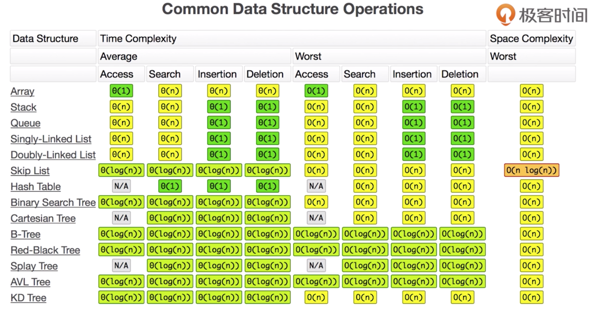

# 07-堆栈-队列-概念

Stack 先入后出  

Queue 先入先出  

stack/queue时间复杂度是一样的。 

练习题： 

#### [844. 比较含退格的字符串](https://leetcode-cn.com/problems/backspace-string-compare/)  

https://leetcode-cn.com/problems/backspace-string-compare/description/ 

#### [232. 用栈实现队列](https://leetcode-cn.com/problems/implement-queue-using-stacks/)  

https://leetcode-cn.com/problems/implement-queue-using-stacks/solution  

#### [225. 用队列实现栈](https://leetcode-cn.com/problems/implement-stack-using-queues/)  

https://leetcode-cn.com/problems/implement-stack-using-queues/description 

#### [20. 有效的括号](https://leetcode-cn.com/problems/valid-parentheses/)  

https://leetcode-cn.com/problems/valid-parentheses/description  