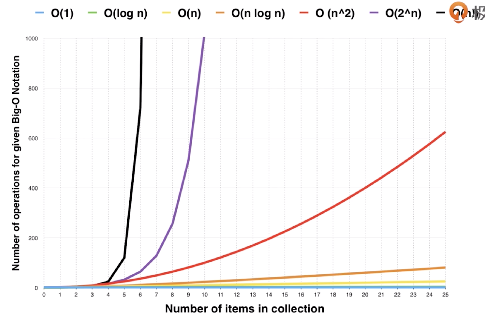

# init

### 目录

[课程介绍](#课程介绍)

[时间复杂度与空间复杂度](#时间复杂度与空间复杂度)

	- 时间复杂度-Big O
	- 递归问题的时间复杂度
	- 常见的递归问题的复杂度

[LeetCode](#LeetCode)


### 课程介绍

1. 推荐书籍：《异类-不一样的成功启示录》

2. 数据结构总图<br/>

   

3. picture<br/>

   


### 时间复杂度与空间复杂度

1. 时间复杂度

   

   ****

   

   

   

   

   ```wiki
   O(1) > O(logn) > O(n) > O(nlogn) > O(n^2) > O(2^N) >O (n!)
   ```

   ****

   递归问题的时间复杂度

   

   

   上述计算过程**有大量的重复计算**，因此并不是O(n)的。<br/>

   **时间复杂度应该是O(2^N)** ，指数级的复杂度<br/>

   主定律（Master Theorem）<br/>

   ***

   **常见的递归算法的时间复杂度** <br>

   

   上述分别是：二分查找、二叉树遍历、二维矩阵查找、排序（快排、归并）

2. 空间复杂度


### LeetCode

https://leetcode.com/problemset/all/ <br/>

一个例题：given nums = [2,7,11,15], target=9。<br/>

找两个数之和为target：<br/>

1. 暴力循环（两层嵌套循环）<br/>

   时间复杂度O(n^2) <br/>

2. 枚举数组元素记为x，然后查询数组元素target-x是否存在，查询一个数组元素是否存在，可以使用set或者哈希表，因此查询的时间复杂度是O(1)，整体算法的时间复杂度是O(N)。<br/>

   ```python
   class Solution:
     def twoSum(self, nums, target):
       hash_map = dict()
       for i,x in enumerate(nums):
         if target-x in hash_map:
           return [i, hash_map[target-x]]
         hash_map[x] = i
   ```

   


