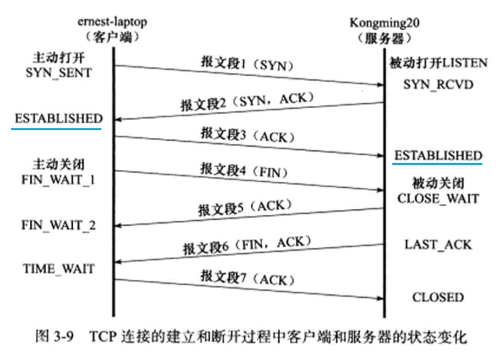

# tcp相关知识

- [几种TCP连接中出现RST的情况 ](https://www.cnblogs.com/xiehongfeng100/p/4768209.html#autoid-1-0-0)
- [端口未打开](https://www.cnblogs.com/xiehongfeng100/p/4768209.html#autoid-2-0-0)
- [请求超时](https://www.cnblogs.com/xiehongfeng100/p/4768209.html#autoid-2-1-0)
- [提前关闭](https://www.cnblogs.com/xiehongfeng100/p/4768209.html#autoid-2-2-0)
- [在一个已关闭的socket上收到数据](https://www.cnblogs.com/xiehongfeng100/p/4768209.html#autoid-2-3-0)
- [长连接与短连接](https://www.cnblogs.com/xiehongfeng100/p/4768209.html#autoid-2-4-0)
- [长连接与短连接概念](https://www.cnblogs.com/xiehongfeng100/p/4768209.html#autoid-3-0-0)
- [长连接与短连接的操作过程](https://www.cnblogs.com/xiehongfeng100/p/4768209.html#autoid-3-1-0)
- [什么时候用长连接，短连接？](https://www.cnblogs.com/xiehongfeng100/p/4768209.html#autoid-3-2-0)
- [长连接程序实例](https://www.cnblogs.com/xiehongfeng100/p/4768209.html#autoid-3-3-0)

### TCP连接与断开的状态

