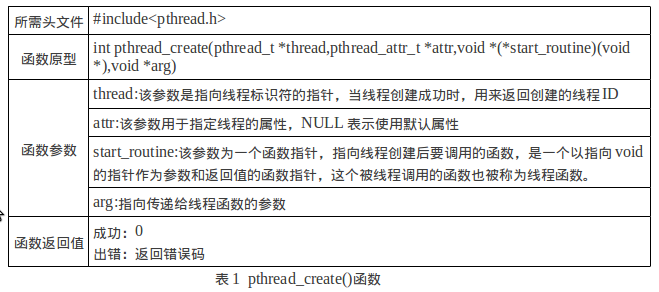
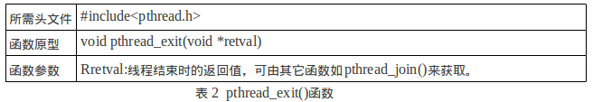
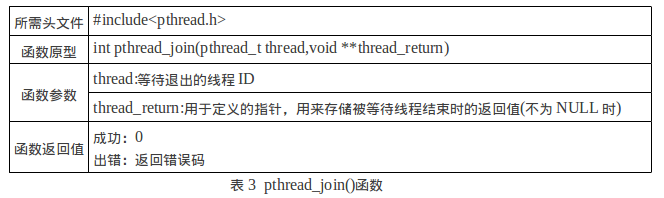
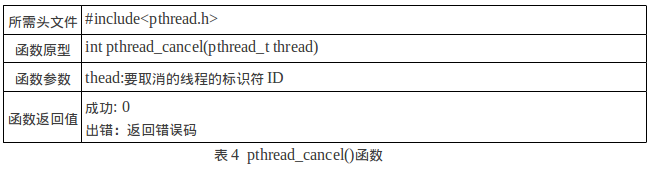
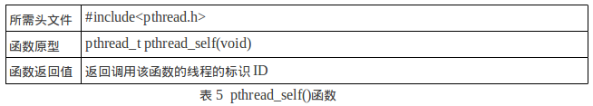
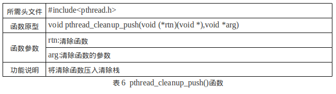
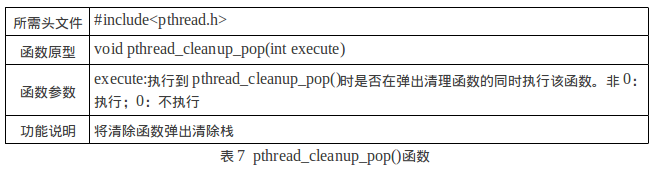

# Multithread Programming

ref:<br/>

1. [Linux下多线程编程详解](https://www.jianshu.com/p/722c32de3f33)

2. [Linux 的多线程编程的高效开发经验](https://www.ibm.com/developerworks/cn/linux/l-cn-mthreadps/index.html)

3. [Linux下多线程以及与进程的区别](https://www.cnblogs.com/skynet/archive/2010/10/30/1865267.html)

4. [Linux多线程编程(一)---多线程基本编程](https://blog.csdn.net/mybelief321/article/details/9377379)

   

### 一道面试题

> 是否熟悉POSIX多线程编程技术？如熟悉，编写程序完成如下功能：
>
> 1）有一int型全局变量g_Flag初始值为0；
>
> 2） 在主线称中起动线程1，打印“this is thread1”，并将g_Flag设置为1
>
> 3） 在主线称中启动线程2，打印“this is thread2”，并将g_Flag设置为2
>
> 4） 线程序1需要在线程2退出后才能退出
>
> 5） 主线程在检测到g_Flag从1变为2，或者从2变为1的时候退出

```c++
/*
 * 1）有一int型全局变量g_Flag初始值为0；
 *
 * 2）在主线称中起动线程1，打印“this is thread1”，并将g_Flag设置为1
 *
 * 3）在主线称中启动线程2，打印“this is thread2”，并将g_Flag设置为2
 *
 */
#include<stdio.h>
#include<stdlib.h>
#include<pthread.h>
#include<errno.h>
#include<unistd.h>

int g_Flag=0;

void* thread1(void*);
void* thread2(void*);

/*
 * when program is started, a single thread is created, called the initial thread or main thread.
 * Additional threads are created by pthread_create.
 * So we just need to create two thread in main().
 */
int main(int argc, char** argv)
{
	printf("enter main\n");
	pthread_t tid1, tid2;
	int rc1=0, rc2=0;
	rc2 = pthread_create(&tid2, NULL, thread2, NULL);
	if(rc2 != 0)
		printf("%s: %d\n",__func__, strerror(rc2));

	rc1 = pthread_create(&tid1, NULL, thread1, &tid2);
	if(rc1 != 0)
		printf("%s: %d\n",__func__, strerror(rc1));
	printf("leave main\n");
	exit(0);	
}
/*
 * thread1() will be execute by thread1, after pthread_create()
 * it will set g_Flag = 1;
 */
void* thread1(void* arg)
{
	printf("enter thread1\n");
	printf("this is thread1, g_Flag: %d, thread id is %u\n",g_Flag, (unsigned int)pthread_self());
	g_Flag = 1;
	printf("this is thread1, g_Flag: %d, thread id is %u\n",g_Flag, (unsigned int)pthread_self());
	printf("leave thread1\n");
	pthread_exit(0);
}

/*
 * thread2() will be execute by thread2, after pthread_create()
 * it will set g_Flag = 2;
 */
void* thread2(void* arg)
{
	printf("enter thread2\n");
	printf("this is thread2, g_Flag: %d, thread id is %u\n",g_Flag, (unsigned int)pthread_self());
	g_Flag = 2;
	printf("this is thread1, g_Flag: %d, thread id is %u\n",g_Flag, (unsigned int)pthread_self());
	printf("leave thread2\n");
	pthread_exit(0);
}

```

> 这样就完成了1）、2）、3）这三点要求。编译执行得如下结果：<br/>

```shell
gcc -lpthread test.c
./a.out 
```

> 如果程序中使用到了pthread库中的函数，除了要#include<pthread.h>，在编译的时候还有加上-lpthread 选项。 

```wiki
结果1
enter main 
enter thread2 
this is thread2, g_Flag: 0, thread id is 3079588720 
this is thread1, g_Flag: 2, thread id is 3079588720 
leave thread2 
leave main 
enter thread1 
this is thread1, g_Flag: 2, thread id is 3071196016 
this is thread1, g_Flag: 1, thread id is 3071196016 
leave thread1 
结果2
enter main 
leave main 
enter thread1 
this is thread1, g_Flag: 0, thread id is 3069176688 
this is thread1, g_Flag: 1, thread id is 3069176688 
leave thread1
结果3
enter main 
leave main
每次运行的结果可能是不同的
取决于主线程main函数何时终止，线程thread1、thread2是否能够来得急执行它们的函数。这也是多线程编程时要注意的问题，因为有可能一个线程会影响到整个进程中的所有其它线程！如果我们在main函数退出前，sleep()一段时间，就可以保证thread1、thread2来得及执行。
```

> 4） 线程序1需要在线程2退出后才能退出”第4点也很容易解决，直接在thread1的函数退出之前调用pthread_join就OK了

> 因为g_Flag是一个全局变量，线程thread1和thread2可以同时对它进行操作，需要对它进行加锁保护，thread1和thread2要互斥访问才行。

> 主线程在检测到g_Flag从1变为2，或者从2变为1的时候退出。就需要用到线程同步技术！线程同步需要条件变量。

#### 试题最终代码

```c++
/*
 是否熟悉POSIX多线程编程技术？如熟悉，编写程序完成如下功能：
  1）有一int型全局变量g_Flag初始值为0；
  2）在主线称中起动线程1，打印“this is thread1”，并将g_Flag设置为1
  3）在主线称中启动线程2，打印“this is thread2”，并将g_Flag设置为2
  4）线程序1需要在线程2退出后才能退出
  5）主线程在检测到g_Flag从1变为2，或者从2变为1的时候退出
   */
#include<stdio.h>
#include<stdlib.h>
#include<pthread.h>
#include<errno.h>
#include<unistd.h>

typedef void* (*fun)(void*);

int g_Flag=0;
static pthread_mutex_t mutex = PTHREAD_MUTEX_INITIALIZER;
static pthread_cond_t cond = PTHREAD_COND_INITIALIZER;

void* thread1(void*);
void* thread2(void*);

/*
 *  when program is started, a single thread is created, called the initial thread or main thread.
 *  Additional threads are created by pthread_create.
 *  So we just need to create two thread in main().
 */

int main(int argc, char** argv)
{
	printf("enter main\n");
	pthread_t tid1, tid2;
	int rc1=0, rc2=0;
	rc2 = pthread_create(&tid2, NULL, thread2, NULL);
	if(rc2 != 0)
		printf("%s: %d\n",__func__, strerror(rc2));

	rc1 = pthread_create(&tid1, NULL, thread1, &tid2);
	if(rc1 != 0)
		printf("%s: %d\n",__func__, strerror(rc1));

	pthread_cond_wait(&cond, &mutex);
	printf("leave main\n");
	exit(0);	
}

/*
 * thread1() will be execute by thread1, after pthread_create()
 * it will set g_Flag = 1;
 */
void* thread1(void* arg)
{
	printf("enter thread1\n");
	printf("this is thread1, g_Flag: %d, thread id is %u\n",g_Flag, (unsigned int)pthread_self());
	pthread_mutex_lock(&mutex);
	if(g_Flag == 2)
		pthread_cond_signal(&cond);
	g_Flag = 1;
	printf("this is thread1, g_Flag: %d, thread id is %u\n",g_Flag, (unsigned int)pthread_self());
	pthread_mutex_unlock(&mutex);
	pthread_join(*(pthread_t*)arg, NULL);
	printf("leave thread1\n");
	pthread_exit(0);
}

/*
 * thread2() will be execute by thread2, after pthread_create()
 * it will set g_Flag = 2;
 */
void* thread2(void* arg)
{
	printf("enter thread2\n");
	printf("this is thread2, g_Flag: %d, thread id is %u\n",g_Flag, (unsigned int)pthread_self());
	pthread_mutex_lock(&mutex);
	if(g_Flag == 1)
		pthread_cond_signal(&cond);
	g_Flag = 2;
	printf("this is thread2, g_Flag: %d, thread id is %u\n",g_Flag, (unsigned int)pthread_self());
	pthread_mutex_unlock(&mutex);
	printf("leave thread2\n");
	pthread_exit(0);
}
```


### 线程概念

线程是指运行中的程序的调度单位。一个线程指的是进程中一个单一顺序的控制流，也被称为轻量级线程。它是系统独立调度和分配的基本单位。同一进程中的多个线程将共享该系统中的全部系统资源，比如文件描述符和信号处理等。一个进程可以有很多线程，每个线程并行执行不同的任务。

### **线程与进程比较**

- 进程是程序执行时的一个实例，即它是程序已经执行到何种程度的数据结构的汇集。**从内核的观点看，进程的目的就是担当分配系统资源（CPU时间、内存等）的基本单位**。

- 线程是进程的一个执行流，是CPU调度和分派的基本单位，它是比进程更小的能独立运行的基本单位。一个进程由几个线程组成（拥有很多相对独立的执行流的用户程序共享应用程序的大部分数据结构），线程与同属一个进程的其他的线程共享进程所拥有的全部资源。

> "进程——资源分配的最小单位，线程——程序执行的最小单位"

**两者区别**：<br>

1. 进程有独立的地址空间，一个进程崩溃后，在保护模式下不会对其它进程产生影响，而线程只是一个进程中的不同执行路径。
2. 线程有自己的堆栈和局部变量，但线程没有单独的地址空间，一个线程死掉就等于整个进程死掉，所以多进程的程序要比多线程的程序健壮，但在进程切换时，耗费资源较大，效率要差一些。因此，对于一些要求同时进行并且又要共享某些变量的并发操作，只能用线程，不能用进程。<br>

**使用多线程的理由**：<br>

1. 线程和进程相比，它是一种非常“节俭”的多任务操作方式。在Linux系统中，启动一个新的进程必须分配给它独立的地址空间，建立众多的数据表来维护其代码段、堆栈段和数据段，这种多任务工作方式的代价非常“昂贵”。而运行于一个进程中的多个线程，它们彼此之间使用相同的地址空间，共享大部分数据，启动一个线程所花费的空间远远小于启动一个进程所花费的空间，而且线程间彼此切换所需要时间也远远小于进程间切换所需要的时间。据统计，总的说来，一个进程的开销大约是一个线程开销的30倍左右，当然，在具体的系统上，这个数据可能会有较大的区别。
2. 线程间方便的通信机制。对不同进程来说它们具有独立的数据空间，要进行数据的传递只能通过通信的方式进行。这种方式不仅费时，而且很不方便。线程则不然，由于同一进程下的线程之间共享数据空间，所以一个线程的数据可以直接为其他线程所用，不仅方便，而且快捷。当然，数据的共享也带来其他一些问题，有的变量不能同时被两个线程所修改，有的子程序中声明为static的数据更有可能给多线程程序带来灾难性的打击，这些正是编写多线程程序时最需要注意的地方。<br>

**除了以上所说的优点外，不和进程比较，多线程程序作为一种多任务、并发的工作方式，当然有以下的优点：** <br>

1. 提高应用程序响应。这对图形界面的程序尤其有意义，当一个操作耗时很长时，整个系统都会等待这个操作，此时程序不会响应键盘、鼠标、菜单的操作，而使用多线程技术，将耗时长的操作（time consuming）置于一个新的线程，可以避免这种尴尬的情况。
2. 使多CPU系统更加有效。操作系统会保证当线程数不大于CPU数目时，不同的线程运行于不同的CPU上。
3. 改善程序结构。一个既长又复杂的进程可以考虑分为多个线程，成为几个独立或半独立的运行部分，这样的程序会利于理解和修改。<br>

> 从函数调用上来说，进程创建使用fork()操作；线程创建使用clone()操作。

### **线程基本编程**

> Linux系统下的多线程遵循POSIX线程接口，称为pthread。编写Linux下的多线程程序，需要使用头文件pthread.h，连接时需要使用库libpthread.a。因为pthread的库不是Linux系统的库，所以在编译时要加上 -lpthread。例如：gcc  filename  -lpthread。注意，这里要讲的线程相关操作都是用户空间中的线程的操作。

1. 线程创建：创建线程实际上就是确定调用该线程函数的入口点，这里通常使用的函数是pthread_create()。在线程创建后，就开始运行相关的线程函数。<br>

   

2. 线程退出：在线程创建后，就开始运行相关的线程函数，在该函数运行完之后，该线程也就退出了，这也是线程退出的一种方法。另一种退出线程的方法是使用函数pthread_exit()，这是线程的主动行为。**这里要注意的是，在使用线程函数时，不能随意使用exit()退出函数来进行出错处理。由于exit()的作用是使调用进程终止，而一个进程往往包含多个线程，因此，在使用exit()之后，该进程中的所有线程都终止了。**在线程中就可以使用pthread_exit()来代替进程中的exit()。<br>

   

3. 线程等待：由于一个进程中的多个线程是共享数据段的，因此，通常在线程退出后，退出线程所占用的资源并不会随着线程的终止而得到释放。正如进程之间可以用wait()系统调用来同步终止并释放资源一样，线程之间也有类似机制，那就是pthread_join()函数。pthread_join()用于将当前进程挂起来等待线程的结束。这个函数是一个线程阻塞的函数，调用它的函数将一直等待到被等待的线程结束为止，当函数返回时，被等待线程的资源就被收回。<br>
   

4. 线程取消：前面已经提到线程调用pthread_exit()函数主动终止自身线程，但是在很多线程应用中，经常会遇到在别的线程中要终止另一个线程的问题，此时调用pthread_cancel()函数来实现这种功能，但在被取消的线程的内部需要调用pthread_setcancel()函数和pthread_setcanceltype()函数设置自己的取消状态。例如，被取消的线程接收到另一个线程的取消请求之后，是接受函数忽略这个请求；如果是接受，则再判断立刻采取终止操作还是等待某个函数的调用等。<br>

   

5. 线程标识符获取：获取调用线程的标识ID。<br>

   

6. 线程清除：线程终止有两种情况：正常终止和非正常终止。线程主动调用pthread_exit()或者从线程函数中return都将使线程正常退出，这是可预见的退出方式；非正常终止是线程在其它线程的干预下，或者由于自身运行出错(比如访问非法地址)而退出，这种退出方式是不可预见的。不论是可预见的线程终止还是异常终止，都回存在资源释放的问题，如何保证线程终止时能顺利地释放掉自己所占用的资源，是一个必须考虑的问题。<br>

   从pthread_cleanup_push()的调用点到pthread_cleanup_pop()之间的程序段中的终止动作(包括调用pthread_exit()和异常终止，不包括return)都将执行pthread_cleanup_push()所指定的清理函数。<br>

   

   

7. > pthread_detach用于是指定线程变为**分离**状态，就像进程脱离终端而变为后台进程类似。成功返回0，否则返回Exxx（为正数）。变为分离状态的线程，如果线程退出，它的所有资源将全部释放。而如果不是分离状态，线程必须保留它的线程ID，退出状态直到其它线程对它调用了pthread_join。

   进程也是类似，这也是当我们打开进程管理器的时候，发现有很多僵死进程的原因！也是为什么一定要有僵死这个进程状态。<br>

### 线程之间的互斥

使用互斥锁（互斥）可以使线程按顺序执行。通常，互斥锁通过确保一次只有一个线程执行代码的临界段来同步多个线程。互斥锁还可以保护单线程代码。<br>

互斥锁的相关操作函数如下：<br>

```c++
#include <pthread.h> 
int pthread_mutex_lock(pthread_mutex_t * mptr); 
int pthread_mutex_unlock(pthread_mutex_t * mptr); 
//Both return: 0 if OK, positive Exxx value on error
int pthread_mutex_init(pthread_mutex_t *restrict mutex, const pthread_mutexattr_t *restrict attr);
```

在对临界资源进行操作之前需要pthread_mutex_lock先加锁，操作完之后pthread_mutex_unlock再解锁。而且在这之前需要声明一个pthread_mutex_t类型的变量，用作前面两个函数的参数。

```c++
//读写模型demo
#include <iostream>
using namespace std;
char buffer;
int buffer_has_item=0;
pthread_mutex_t mutex;
void writerFunc(){
        while(1) {
                /* 锁定互斥锁*/
                pthread_mutex_lock (&mutex);
                buffer_has_item++;
                cout<<"write "<<buffer_has_item<<endl;
                /* 打开互斥锁*/
                pthread_mutex_unlock(&mutex);
                usleep(1000*200);
        }
}
void *readerFunc(void *ptr){
        while(1) {
                pthread_mutex_lock(&mutex);
                if(buffer_has_item>0) {
                        cout<<"read >>>> "<<buffer_has_item<<endl;
                        buffer_has_item--;
                }
                pthread_mutex_unlock(&mutex);
                usleep(1000*500);
        }
}
int main(){
        pthread_t id;
        pthread_mutex_init (&mutex,NULL);
        pthread_create(&id, NULL,readerFunc, NULL);
        writerFunc();
        return 0;
}

```

```c++
结果
[root@localhost threadDemo]# ./second 
write 1
read >>>> 1
write 1
write 2
read >>>> 2
write 2
write 3
read >>>> 3
```


### 线程间同步--条件变量

使用互斥锁来实现线程间数据的共享和通信，互斥锁一个明显的缺点是它只有两种状态：锁定和非锁定。对于消费者，它根本不知道什么时候生产者已经生产了数据，只能通过轮询来检测，这就有两个缺陷：

- 1. 轮询会占用CPU资源
- 1. 轮询的时间不好控制，可能导致消费者执行不及时。

```wiki
为了解决上面这个问题，我们这样考虑。线程在阻塞之前要先解锁（个人想法：消费线程已经获得了要访问资源的锁，但是，即使我获得了资源的锁，但是由于条件暂时还不满足，我无法用这个资源，所以我想暂时让出这把锁，让锁里的资源暂时为别人所用，所以在挂起前，我需要解锁），同时还要将自己的标识符放入一个地方，以便生产线程通过这个标识符来激活自己。那新问题又来了，由于线程之间是并发/并行的。消费线程可能刚完成解锁的操作，就被生产线程获取到了并开始执行，这时，因为消费线程还未挂起自己，来不及将自己的标识符保存在某个位置，所以生产线程不认为有正在等待的线程（生产线程想告诉消费线程的唯一方式就是认消费线程的标识符）。这时，切换到消费线程后，消费线程将永远的等待下去，虽然队列中有产品，但生产线程也不会告诉消费线程。而生产线程因为队列中有产品可能也一直的等待下去，形成了死锁。

这里死锁的原因很明确，就是因为消费线程在阻塞之前要先解锁解、保存线程标识符、挂起这一系列操作不是原子操作。想要让这一些列的操作成为原子操作，就得引入条件变量，所以不难想到使用条件变量的时候必须要“伴随”一个互斥量。
```

**条件变量是与互斥量相关联的一种用于多线程之间关于共享数据状态改变的通信机制。**它将解锁和挂起封装成为原子操作。等待一个条件变量时，会解开与该条件变量相关的锁，因此，使用条件变量等待的前提之一就是保证互斥量加锁。线程醒来之后，该互斥量会被自动加锁，所以，在完成相关操作之后需要解锁。<br/>

如果条件为假，线程通常会基于条件变量阻塞，并以原子方式释放等待条件变化的互斥锁。如果另一个线程更改了条件，该线程可能会向相关的条件变量发出信号，从而使一个或多个等待的线程执行以下操作：<br/>

- 唤醒
- 再次获取互斥锁
- 重新评估条件

在以下情况下，条件变量可用于在进程之间同步线程：<br/>

- 线程是在可以写入的内存中分配的
- 内存由协作进程共享

```wiki
- pthread_cond_wait
  线程解开mutex指向的锁并被条件变量cond阻塞。线程可以被函数pthread_cond_signal和函数pthread_cond_broadcast唤醒。但是要注意的是，条件变量只是起阻塞和唤醒线程的作用，具体的判断条件还需用户给出，例如一个变量是否<=0等等
- pthread_cond_signal
  用来释放被阻塞在条件变量cond上的一个线程。多个线程阻塞在此条件变量上时，哪一个线程被唤醒是由线程的调度策略所决定的。
```

```c++
#include <pthread.h> 
int pthread_cond_wait(pthread_cond_t *cptr, pthread_mutex_t *mptr); 
int pthread_cond_signal(pthread_cond_t *cptr); 
//Both return: 0 if OK, positive Exxx value on error
pthread_cond_wait用于等待某个特定的条件为真，pthread_cond_signal用于通知阻塞的线程某个特定的条件为真了。在调用者两个函数之前需要声明一个pthread_cond_t类型的变量，用于这两个函数的参数。
```

- 通常，pthread_cond_wait只是唤醒等待某个条件变量的一个线程。
- 如果需要唤醒所有等待某个条件变量的线程，需要调用：`int pthread_cond_broadcast (pthread_cond_t * cptr);`
- 默认情况下面，阻塞的线程会一直等待，知道某个条件变量为真。如果想设置最大的阻塞时间可以调用：`int pthread_cond_timedwait (pthread_cond_t * cptr, pthread_mutex_t *mptr, const struct timespec *abstime);` 如果时间到了，条件变量还没有为真，仍然返回，返回值为`ETIME。`

```c++
//互斥量与条件变量demo
#include <iostream>
using namespace std;
int buffer_has_item=0;
pthread_mutex_t mutex;
pthread_cond_t count_nonzero;
void writerFunc(){
        while(1) {
                pthread_mutex_lock (&mutex);
                buffer_has_item+=2;
                cout<<"write "<<buffer_has_item<<endl;
                pthread_mutex_unlock(&mutex);
                //激活阻塞的读线程
                pthread_cond_signal(&count_nonzero);
                usleep(1000*200);
        }
}
void *readerFunc(void *ptr){
        while(1) {
                pthread_mutex_lock(&mutex);
                if(buffer_has_item<=0) {
                        //暂时解锁，把资源让出，等待写线程写入。
                        //被激活后会自动加锁
                        pthread_cond_wait( &count_nonzero, &mutex);
                }
                cout<<"read >>>> "<<buffer_has_item<<endl;
                buffer_has_item--;
                pthread_mutex_unlock(&mutex);
        }
}
int main(){
        pthread_t id;
        pthread_mutex_init (&mutex,NULL);
        pthread_create(&id, NULL,readerFunc, NULL);
        writerFunc();
        return 0;
}
```

> 为什么条件变量始终与互斥锁一起使用，对条件的测试是在互斥锁（互斥）的保护下进行的呢？因为“某个特性条件”通常是在多个线程之间共享的某个变量。互斥锁允许这个变量可以在不同的线程中设置和检测。


### 信号量

线程的信号量与进程间通信中使用的信号量的概念是一样，它是一种特殊的变量，本质上是一个非负的整数计数器，它被用来控制对公共资源的访问。它可以被增加或减少，但对其的关键访问被保证是原子操作。如果一个程序中有多个线程试图改变一个信号量的值，系统将保证所有的操作都将依次进行。
信调用函数sem_post（）增加信号量。只有当信号量值大于０时，才能使用公共资源，使用后，函数sem_wait（）减少信号量。

```c++
#include <iostream>
#include <semaphore.h>
#include <string.h>
#include <stdio.h>
using namespace std;
//信号量
sem_t sem;
void * run(void *ptr){
        char *buf=(char *)ptr;
        while(strcmp("exit\n",buf)!=0) {
                //新号量-1
                sem_wait(&sem);
                cout<<"thread output>> "<<buf<<endl<<flush;
        }
        return 0;
}

int main(){
        char buf[100]={0};
        int ret=0;
        pthread_t id;
        //初始化信号量数量为2。默认类型，非0位进程间共享
        ret=sem_init(&sem, 0, 2);
        if(ret) {
                cout<<"sem_init failed"<<endl;
        }
        pthread_create(&id,NULL,run,buf);
        //循环从标准输入读（fgets会将\n也读入）
        while(fgets(buf,sizeof(buf),stdin)) {
                if(strcmp("exit\n",buf)==0) {
                        break;
                }
                //信号量+1
                sem_post(&sem);
        }
        //清理信号量
        sem_destroy(&sem);
        return 0;
}
```

> semaphore.h头文件

- sem_init
  初始化信号量。该函数初始化由sem指向的信号对象，设置它的共享选项，并给它一个初始的整数值。pshared控制信号量的类型，如果其值为0，就表示这个信号量是当前进程的局部信号量，否则信号量就可以在多个进程之间共享，value为sem的初始值。调用成功时返回0，失败返回-1.
- sem_post ( sem_t *sem )
  该函数用于以原子操作的方式将信号量的值加1。当有线程阻塞在这个信号量上时，调用这个函数会使其中的一个线程不在阻塞，选择机制同样是由线程的调度策略决定的。
- sem_wait( sem_t *sem )
  被用来阻塞当前线程直到信号量sem的值大于0，解除阻塞后将sem的值减1，表明公共资源经使用后减少。
- sem_destroy
  该函数用于对用完的信号量的清理


