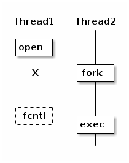
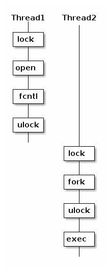
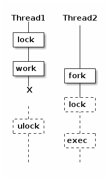

# fork 使用注意

Ref: https://blog.kghost.info/2013/04/27/fork-multi-thread/ <br/>

fork 会创建一个新进程，新创建的子进程继承父的所有属性，除了：<br/>

- 进程id：系统会分配一个新的进程 ID 给 fork 出来的子进程<br/>
- 除了调用 fork 的线程，其他线程强制终止<br/>

基本使用：<br/>

```c++
pid_t pid = fork();
if (pid < 0) {
  // error process
} else if (pid > 0) {
  // parent
  waitpid(pid, ...);
} else {
  // child

  execv(prog, ...);
}
```


## 使用的时候需要注意的问题

### 关闭文件

由于 fork 会继承父进程的所有打开的文件，而且 exec 函数不会关闭这些文件，所以需要在运行 exec 前确保这些文件被关闭，下面两种方法：<br/>

1. 手动关闭所有文件<br/>

   在调用 exec 前，遍历并关闭所有文件，如果调用 exec 前没有关闭这些文件，子进程可以任意读写这些文件，可能会引起安全问题。所以，必须在调用 exec 之前关闭所有子进程不需要使用的文件描述符。<br/>

   如果在一些特定环境下，ulimit 的最大文件描述符数量设置得非常大，并且程序又需要频繁创建子进程，那么关闭每次都需要关闭大量文件描述符会浪费掉大量 CPU 资源，在优化程序的时候特别要注意这点。<br/>

2. 使用 close_on_exec 关闭文件<br/>

   从close_on_exec名字可以看出，该方法可以在调用 exec 的时候自动关闭这个文件，只需要给文件描述符设置这个 flag。<br/>

   ```c++
   fcntl(fd, F_SETFD, FD_CLOEXEC);
   ```

   那么在执行到 exec 的时候，这个 fd 就会被自动关闭。<br/>

   ```wiki
   File descriptor flags 与 File status flags
   
   为了搞清楚这两个东西的关系，需要理解 File descriptor 与 File description
   
    * File descriptor：文件描述符，通过 dup 可以复制文件描述符，得到两个不同的文件描述符
    * File description：文件对象，通过 dup 得到的两个文件描述符指向同一个文件对象
   
    * File descriptor flags：File descriptor 对应的 flag
    * File status flags：File description 对应的 flag
   
   所以 dup 得到的两个不同的文件描述符拥有不同的 File descriptor flags，但是却共享 File status flags
   
   下面是几个典型的 flags:
   
   File descriptor flags
    * CLOSEXEC
   
   File status flags
    * O_NONBLOCK
    * O_DIRECT
   ```

   我们可以为每个 fd 设置 close-on-exec，那么在 exec 的时候文件就会被自动关掉。但是在多线程中就不是那么简单了，考虑下面这个场景：<br/>

   

   > 由于线程1在调用 open 后，未来得及调用 fcntl设置 close-on-exec，线程2调用了 fork，子进程中线程1会被强行终止，无法设置 close-on-exec，虽然父进程中线程1仍然能够正确执行，但是子进程与父进程的 fd 不共享 File descriptor flags，所以子进程的 fd 没有 close-on-exec，在调用 exec 的时候会泄漏 fd。

   所以，必须保证 open 与设置 close-on-exec 为原子操作，为此，linux 修改了所有会新建 fd 的 API：<br/>

   - open<br/>
   - opendir<br/>
   - socket<br/>
   - accept<br/>
   - pipe2<br/>
   - dup3<br/>

   在某些操作系统中，由于系统没有提供上述 API，无法保证打开文件描述符与设置 close-on-exec 的原子性，则需要通过额外的锁来控制：<br/>

   

   golang 为了保证移植性，使用的就是此方法。<br/>

   ⁉️ 这种情形，线程1被锁住了，线程二调用fork时，线程1就不会强行终止了么？？<br/>


### 死锁

考虑下面这个场景：<br/>



由于持有锁的线程1被强行终止了，子进程中将永远无法获取到锁，于是程序死锁。解决这个问题的方法也非常简单，在 fork 之后，exec 之前不要使用任何锁。说来简单，但是实际上陷阱非常多，因为 libc 里面有大量函数使用了锁，例如最常用的 malloc/free 函数中就有锁。如果在进程1申请内存的时候进程2调用了 fork，并且在 exec 之前尝试申请内存就会产生死锁。POSIX 标准维护了一个函数列表 Async-signal-safe functions，需要确保程序在 exec 之前不会调用任何此列表之外的任何函数，exec 后会重置所有进程状态，之前线程获取的锁会直接被销毁。<br/>

(⁉️ 没有理解)